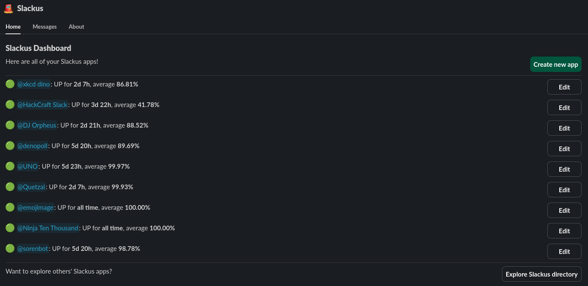

# Slackus

**The status bot for Slack bots!**

Slackus is a Slack bot to monitor the status of other Slack bots in a workspace. Its versatile system allows almost any bot to be monitored, and features a robust notification system to notify people & channels when a Slack bot is down or back up.

Additionally, the public directory and `/slackus` command allows users to check the uptime and status of any bot tracked by Slackus. Slackus aims to remove the need for the question, _"Is \<bot\> down?"_

## Usage

The primary place to interact with Slackus is in its App Home. Here, you will find Slackus' dashboard, where you can see the uptime of all of your apps, edit your apps, create new apps, and browse the public directory.

Slackus also has 2 commands:
- `/slackus [bot user]`: Allows you to check on a bot tracked by Slackus or create a new app
- `/directory`: Opens the public directory 

## Technical Details

### Running Slackus

Slackus is designed to be easily developed and deployed, and is composed of two services.

#### Bot

This is the actual Slack bot. It uses Slack's Bolt framework for JavaScript, but the code itself is written in TypeScript. All code is organized within the `src` directory.

Use the `example.env` file as a guide for environment variables.

#### Runner

This is the API server that runs commands for the command method, since there is no official API for it. It uses Express and Puppeteer, and is written in TypeScript. All code is in the `src` directory.

Use the `example.env` file as a guide for environment variables.

### Methods

Slackus currently supports 3 different methods to check a bot's status:

- **HTTP Method**: The recommended way to check status. Slackus will send an HTTP request to your specified endpoint on the specified interval. A 200 response means UP - any other status code means DOWN.
- **Heartbeat Method**: Useful if your bot does not have a public endpoint. Your bot should send a HTTP request to the provided Slackus endpoint within the specified interval, or Slackus will assume your bot is DOWN.
- **Command Method**: Not recommended if you can use the other 2 methods. Slackus will run the specified command in a public Slack channel on the interval, and will mark your bot as DOWN if Slackbot responds with an error. Occasionally returns false failures.
